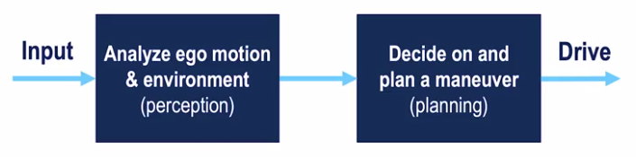
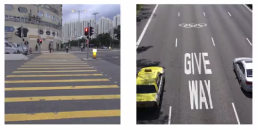

# Week 1. The Requirements for Autonomy

This module will introduce you to the main concepts and layout of the specialization and discusses the major advances made in the field over the last two decades, highlighting the most recent progress made by major players in terms of safety and performance metrics, where available.

## Technical terms and definition

- Driving tasks: the driving task is made up of three sub-tasks
  - Perception: perceiving the environment
  - Motion Planning: planning how to reach from point A to B
  - Vechicle Control: take appropriate steering, braking and acceleration decisions to control the vehicle's position and velocity on the road
- Operational Design Domain (ODD): constitutes the operating conditions under which a given system is designed to function
  - Environmental
  - Time of day
  - Roadway
  - Other characteristics under which the car will perform reliably

Especially, clearly defining the operating conditions for which a self-driving car is designed, is crucial to ensuring the system's safety.

What makes up a driving task?

- Lateral control - steering such as turning left, right, going straight or tracking a curve and so on
- Longitudinal control - braking, accelerating, which controls the position or velocity of the car along the roadway
- Object and Event Detection and Response (OEDR): the ability to detect objects and events
that immediately affect the driving task and to react to them appropriately

- Planning
  - Short term
  - Long term
- Miscellaneous: tasks that people do while driving as well.
  - Signaling with indicators
  - Hand-waving
  - Interact with other drivers and so on

## Lesson 1. Taxonomy of Driving

Autonomous Capabilities

- Automated lateral control?
- Automated longitudinal control?
- OEDR
  - Automatic emergency response
  - Driver supervision
- Complete vs Restricted ODD

Commonly-used levels of
automation defined by the SAE Standard J3 016:

- Level 0: No Automation
  - Regular vehicles, no automation
  - Everything is done by the driver
- Level 1: Driving Assistance
  - An autonomous system assist the driver by performing either lateral or longitudinal control tasks (Either but not both)
  - Example:
    - Adaptive Cruise Control
      - can control speed, driver has to steer
    - Lane Keeping Assistance
      - can help you stay in lane, if you drift
- Level 2: Partial Driving
  - The system can perform both the control tasks,lateral and longitudinal in specific driving scenarios.
  - Example:
    - GM Super Cruise
    - Nissan ProPilot Assist
  - These can control both your lateral and longitudinal motion but the driver monitoring of the system is always required
- Level 3: Conditional Driving Automation
  - the system can perform Object and Event Detection in Response to a certain degree in addition to the control tasks
  - However, in the case of failure, the control must be taken up by the driver
  - The driver doesn't need to pay attention in certain situations, as the vehicle can alert the driver in time to intervene.
  - Example:
    - Audi S8 Sedan
- Level 4: High Driving Automation
  - Capable of reaching a minimum risk condition, in case the driver doesn't intervene in time for an emergency
  - The system can handle emergencies on their own but still ask drivers to take over to avoid pulling over to the side of the road unnecessarily.
  - The driver can entirely focus on their tasks
- Level 5: High Driving Automation
  - The system is fully autonomous and its ODD is unlimited
  - It can operate under any condition necessary

## Lesson 2. Requirements for Perception

Very roughly speaking, any driving tasks can be broken down into two components. First, we need to understand what's happening around us and where we are. So, we need to perceive our surroundings. Secondly, we need to make a driving decision.

For example,should we accelerate or stop before a pedestrian about to enter the roadway?

Furthermore, any driving task requires some kinds of OEDR, that is we need some way of identifying objects around us, recognizing events happening near us, and then respond to them.

Therefore, if we want to build a self-driving car, we need to be able to perform OEDR.

### Object and Event Detection and Response (OEDR)

- Recall this is a criterion for automation

### What is perception?

- We want to make sense of the environment and ourselves
- Two things:
  - identification - a car, a cyclist, a bus, etc.
  - understanding motion
- Why?
  - As human, we're really good at understanding patterns
  - However, it's still difficult for computer systems to be able to recognize these same patterns around us as quickly as we do
  - to inform our driving decisions. For example, if I know what the car in front of me going to do next, then I can decide what to do next in such a way that both of our goals are met

### Goals of perception

- Static objects:
  - Road and lane markings (on-road)

  - Curbs (off-road): define the boundaries within which we can drive

  - Traffic lights (off-road)
  - Road signs (off-road): speed limit,indicating direction, whether there is a hospital coming up, etc.
  - Construction signs, obstructions, and more (on-road)

- Dynamic objects (on-road)
  - Vehicles
    - 4 wheelers (cars, trucks,...)
    - 2 wheelers (motorbikes, bicycles...)
  - Pedestrians
- Ego localization: We need to estimate where we are and how we are moving at any point in time, which is crucial to making informed and safe driving decisions
  - Position
  - Velocity, acceleration
  - Orientation, angular motion
  - The data used for ego motion estimation comes from GPS, IMU, and odometry sensors, and needs to be combined together to generate a coherent picture of our position

### Challenges to perception

- Robust detection and segmentation, which can be approached with modern machine learning methods, but there is much ongoing research to improve the reliability and performance to achieve humal level capability
- Sensor uncertatinty: There are many times that visibility can be challenging, or GPS measurement gets corrupted, or LIDAR and Radar returns are noisy in terms of their position value
- Occlusion, reflection: These can confuse perception methods with ambiguous information that is challenging to resolve into accurate estimates ob object locations

- Illumination, lens flare: There are also effects such as drastic illumination changes and lens flare, or GPS outages and tunnels which makes some sensor data completely unusable or unavailable

- Perception methods need multiple redundant sources of
information to overcome sensor data loss
- There's weather and precipitation that can adversely affect the quality of input data from sensors. Therefore, it is crucial to have at least some sensors that are immune to different weather conditions, for example radar

### Supplementary Reading: Requirements for Perception

To learn more about the KITTI Vision Benchmark Suite, check out this link: <http://www.cvlibs.net/datasets/kitti/>

## Lesson 3: Driving Decisions and Actions

Making decisions

- Long term
  - A high-level plan for the entire driving task
  - Mapping applications that you today are able to give yoy these driving intructions: which roads to take, which lanes to be in, and so on
  - How to navigate from New York to Los Angeles?
- Short term
  - Can I change my lane to the lane right of me?
  - Can I pass this intersection and join the left road?
- Immediate: involves control and trajectory planning
  - Can I stay on track on this curved road?
  - Acclerate or brake, by how much?

Example: Turning left at an intersection

- This was a simple maneuver, yet it takes 3-4 levels of decisions and control to execute
- Consider how many rules would it takes to drive
  - safely
  - efficiently
  - following all listed traffic rules
  - only follow those rules everyone else is following!
- **Driving decision making is complicated!**

### Rule Based Planning

- What we just did was rule based planning
  - Involved decision trees!
- In reactive rule based planning, we have rules that take into account the current state of ego and other objects and give decisions
- These are rules that only consider the current state and not future predictions
- Examples:
  - If there is a pedestrian on the road, stop
  - If speed limit changes, adjust speed to match it

### Predictive Planning

In predictive planning, we make predictions on how other agents in the environment like vehicles and pedestrians, will move over time.

- Make predictions about other vehicles and how they are moving. Then use these predictions to inform our decisions.
- Example:
  - That car has been stopped for the last 10 seconds. It is going to be stopped for the next few seconds.
  - Pedestrian is jaywalking. She will enter our lane by the time we reach her.

This type of planning, however, relies on accurate predictions of the actions of the other actors in the environment, which adds a significant layer of complexity to the perception tasks.

Nonetheless, predictive planning is the predominant method for self-driving cars, as it greatly expands the scenarios a vehicle can handle safely

### Supplementary Reading: Driving Decisions and Actions

If you're curious about motion planning and other high-level behaviour, check out [Frazzioli’s Survey for Autonomous Planning](https://ieeexplore.ieee.org/abstract/document/7490340).

This paper, [Autonomous driving in urban environments: Boss and the Urban Challenge](https://onlinelibrary.wiley.com/doi/abs/10.1002/rob.20255); discusses one of the very early mixed planning systems. It was also the winner of the DARPA Urban Challenge