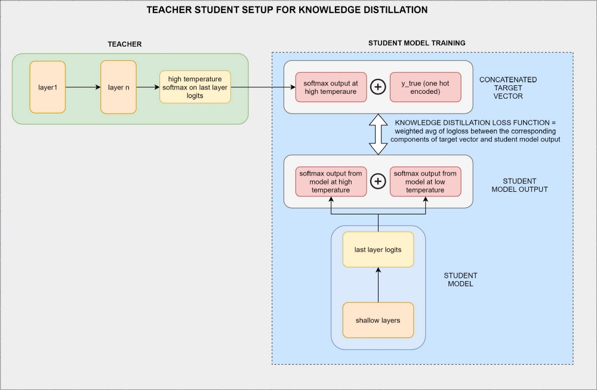
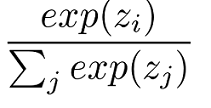
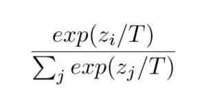
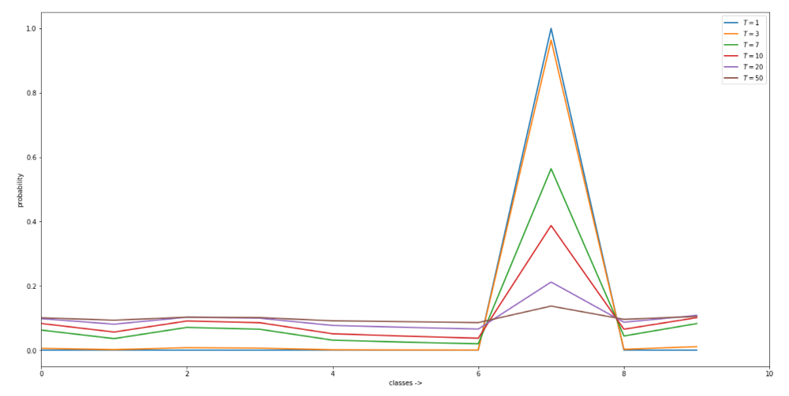

# Distilling the Knowledge in a Neural Network

**Motivation**: The main objective of any ML/AI model is determined by how well it can generalize on unseen data as opposed to how well it performs on the training data. If we look at this objective more closely, it is preferred to have different model adaptations for training and inference purposes. During training, we need deep and complex models so as to train upon a large amount of training data but during inference, we just need a lighter model that generalizes well on any unseen data. The lighter model obviously has a good performance during inference time in production. So the context setting for this article is to see if there is an effective way to distill this generalized knowledge to a lighter model to get the best of both worlds.

**Paper**: https://arxiv.org/abs/1503.02531

## Difference between Transfer learning & Knowledge distillation:

- In transfer learning, the weights are transferred from a pre-trained network to a new network and the pre-trained network should exactly match the new network architecture.
What this means is that the new network is essentially as deep and complex as the pre-trained network.

- Knowledge distillation is not to transfer weights but to transfer the generalizations of a complex model to a much lighter model.
Enter the terminology of teacher-student network, concept of temperature in softmax activation, dark knowledge and softened probabilities…

**Teacher-Student model**: Teacher, in this example, is a deep neural net that has been trained upon a large amount of data with good enough regularization (or it can be any other ensemble model) so that the main objective for it is that it can generalize well on unseen data. A student network is a light shallow network that would get trained by the teacher with its main objective being — Learn most of the teacher generalizations and still be lighter. A lighter model is obviously preferred in production for its quick predictions given the stringent production constraints.

    

Figure 1. Teacher-Student architecture for knowledge distillation

## Concept of temperature in softmax activation:

The main advantage of using softmax is the output probabilities range. The range of output probabilities will be from 0 to 1, and the sum of all the probabilities will be equal to one. It returns the probabilities of each class and the target class will have the high probability.

    

Figure 2a. Regular Softmax function

The formula computes the exponential (e-power) of the given input value and the sum of exponential values of all the values in the inputs. Then the ratio of the exponential of the input value and the sum of exponential values is the output of the softmax function.

    

Figure 2b. High temperature softmax

A high temperature softmax activation function is obtained when we divide the inputs — ‘z’ (also called as logits in neural nets) with ‘T’ (temperature).

To illustrate the effect of temperature on softmax activation, consider the plot below in Figure 3. As can be observed, the probability of predicting the number ‘7’ get softened and softened as the temperature increases. What do we mean by softened probabilities?

If you follow the green line (plotted at higher temperature=7) and observe the probability values closely, you can see that the model clearly brings out the fact that it predicts a number ‘7’ that looks more similar to 9 or 1 than to 6 (the predicted probability of 6 is less than 0.01 whereas the predicted probability of 1 is around 0.075).

If you follow the orange/blue line (plotted at lower temperatures) and observe the probability values closely, you can see that the model is predicting number ‘7’ with a very high confidence but is **NOT** capable of distinguishing if the predicted number 7 is closer to 1 or 6 (they all have “very near to zero” probabilities).

    

Figure 3. Probability prediction for the number ‘7’ digit at varied temperatures

**Dark knowledge**: We can very well correlate our own guess by looking at a handwritten number ‘7’ and say if its similar looking to 1 — This is much like this model that outputs higher probability for ‘1’ while predicting number ‘7’ at high temperature.

The only difference being that we humans cannot quantify how much that ‘7’ is looking closer to 1 whereas a high temperature model does that with a good accuracy. So a high temperature model is considered to be having a **dark knowledge** — i.e., in addition to just predicting the number as ‘7’, it also stores the information as to how closely that number ‘7’ resembles number ‘1’.

A low temperature model (the models that we generally come across without temperature in softmax) are usually good at hard predictions and we lose this dark knowledge. The main idea behind the knowledge distillation is transferring this dark knowledge from a well trained teacher to a lighter student model.

**Teacher-Student training**: Now that we have understood the context and all other important terms, lets come back to where we left in the teacher-student model. The working principle to transfer these generalizations to student is very simple as illustrated in Figure 1. While training the student, instead of making the one-hot encoded values as hard targets, these softened probabilities (outputs collected by applying high temperature softmax) are made as target. We can also make a customized knowledge distillation loss function (refer to Figure 1 illustration) that computes knowledge distillation loss as weighted average of logloss between the corresponding components of concatenated vector of "soft targets + hard targets".

Results show that a student trained in this fashion from a teacher (accuracy improvements are observed in the order of 1% to 2% increase) is able to generalize well on unseen data than a stand-alone student trained on the same data.

**Notes**:

- Student is trained at the same high temperature softmax as the teacher.

- The inferences from student model are to be done with the usual softmax activation (i.e without temperature).

**Advantages of knowledge distillation**:

- Using a lighter model

- Less compute requirements and superior performance under stringent production constraints

- Better accuracy than stand-alone model

- Can be used even when there is lesser training data available for the student model. It is enough to have a well trained teacher.
