# Week 2. Self-Driving Hardware and Software Architectures

System architectures for self-driving vehicles are extremely diverse, as no standardized solution has yet emerged. This module describes both the hardware and software architectures commonly used and some of the tradeoffs in terms of cost, reliability, performance and complexity that constrain autonomous vehicle design.

Learning Objectives:

- Design an **omni-directional multi-sensor** system for an autonomous vehicle
- Describe the basic architecture of a typical self-driving software system
- Break down the mapping requirements for self-driving cars based on their intended uses.

## Lesson 1. Sensors and Computing Hardware

### Sensors types and characteristics

- Sensors: device that measures or detect a property of the environment, or changes to a property
- Categorization:
  - exteroceptive: extero = surroundings
  - proprioceptive: proprio = internal
- Sensors for perception:
  - Essential for correctly perceiving the environment
  - Comparison metrics:
    - Resolution
    - Field of view
    - Dynamic range
  - Trade-off between resolution and FOV?

- Depth estimation

- LIDAR:

  - LIDAR stands for light detection and ranging sensor
  - LIDAR sensing involves shooting light beams into the environment and measuring the relected return
  - LIDAR usually includes a spinning element with multiple stacked light resources
  - LIDAR outputs a **3D point cloud map**, which is great for assessing scene geometry
  - Not affected by the environment lighting
- RADAR:
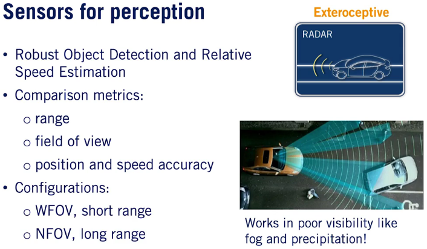
  - Robust Object Detection and Relative Speed Estimation
- Ultrasonic:
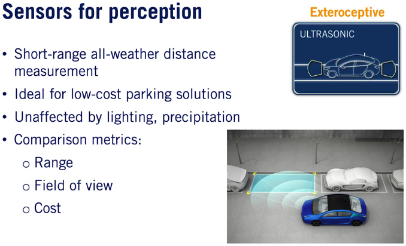

- GPS/IMU:

- Wheel Odometry:
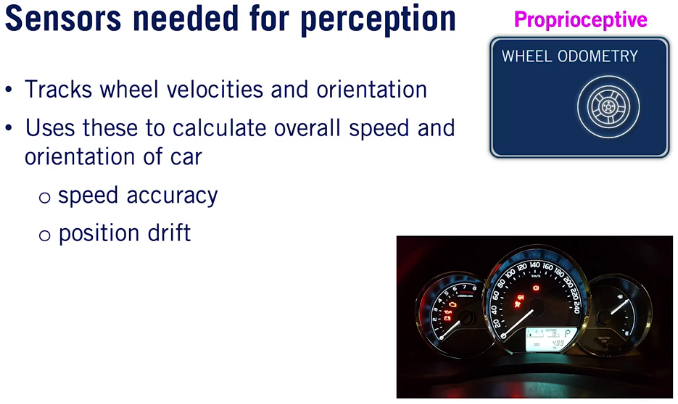

### Computing hardware

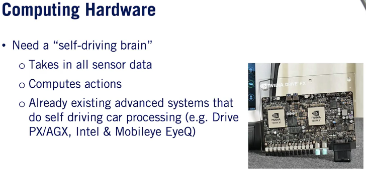

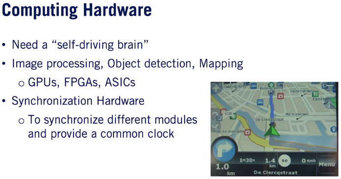

### Supplementary Reading: Sensors and Computing Hardware

If you want to read more about sensors and computing hardware, check out **Section 4** from the [ME597 - Autonomous Mobile Robotics Course](http://wavelab.uwaterloo.ca/sharedata/ME597/ME597_Lecture_Slides/ME597-4-Measurement.pdf) at the University of Waterloo.

## Lesson 2. Hardware Configuration Design

### Assumptions

- Aggressive deceleration = $5m/s^2$
- Comfortable deceleration = $2m/s^2$
  - This is the norm, unless otherwise stated
- Stopping distance: $d = \frac{v^2}{2a}$

### Where to place sensors

- Need sensors to support maneuvers within our ODD
- Broadly, we have two driving environments

|                | Highway                       | Urban / Residential          |
| -------------- | ----------------------------- | ---------------------------- |
| Traffic Speed  | High                          | Low                          |
| Traffic Volume | High                          | Medium                       |
| # of lanes     | More                          | 2-4 typically                |
| Other Features | Fewer, gradual curves; merges | Many turns and intersections |

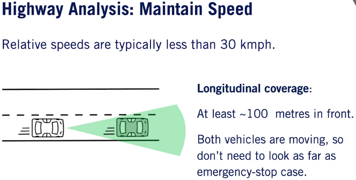

Laterally, we need to know what's happening anywhere in our adjacent lanes in case another vehicles seeks to merge into our lane or we need to merge with another traffic

- A wide 160 to 180 degree field of view is required to track adjacent lanes and a range of 40 to 60 meters is needed to find space between vehicles

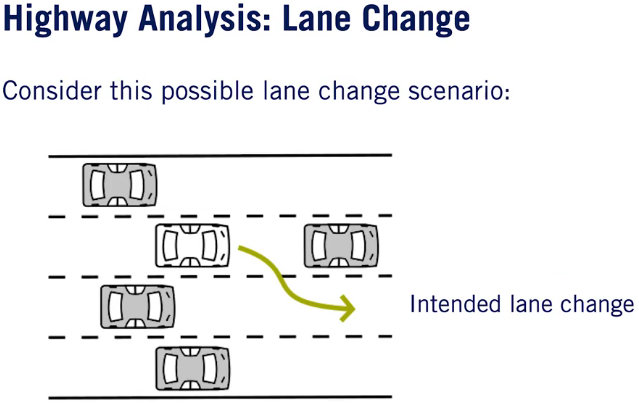

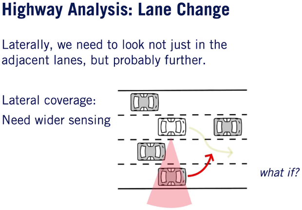

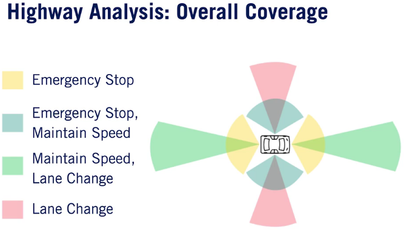

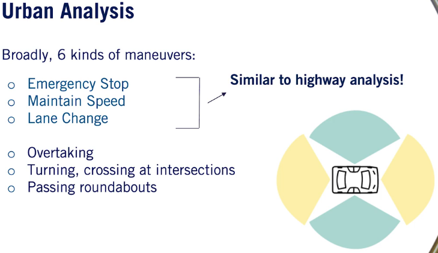

Longitudinally, we definitely need to sense the parked car as well as look for oncoming traffic.

Therefore, we need both sensors, **wide short-range sensors** to detect the parked car and narrow **long-range sensors** to identify if oncoming traffic is approaching.

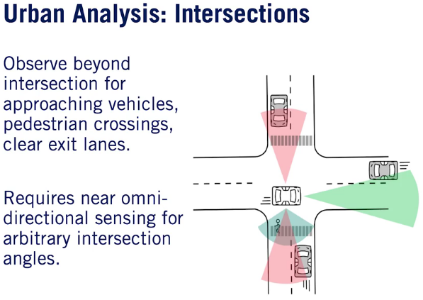

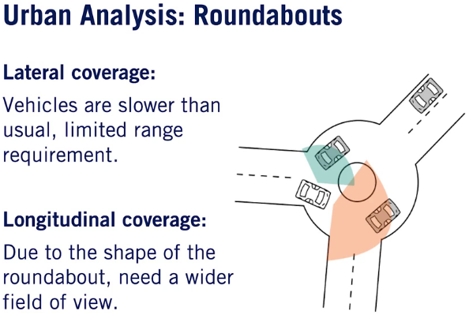

### Supplementary Reading: Hardware Configuration Design

To learn more about sensing requirements for automated vehicles for highway and rural environments, check out [K.J. Bussemaker's master's thesis](https://repository.tudelft.nl/islandora/object/uuid:2ae44ea2-e5e9-455c-8481-8284f8494e4e).

## Lesson 3. Software Architecture

### Software Architecture | High-level

The car observes the environment around it, using a variety of sensors.

The raw sensor measurements are passed into two sets of modules dedicated to understand the environment around the car.

### Environment Perception

The environment perception modules have two key responsibilities.

- Identifying the **current location** of autonomous vehicle in space
- Classifying and locating important elements of the environment for the driving task

Examples of the elements include other cars, bikes, pedestrians, the road markings, and road signs, anything that directly affects the act of driving.

- The localization module takes in multiple streams of information
  - GPS
  - IMU measurements
  - Wheel odometry
- For greater accuracy, some localization modules also **incorporate LIDAR and camera data**.
- Typically, the problem of classification and localization of the environmental elements is divided into two segments:
  - Detecting dynamic objects in the environment
    - Use a set of camera inputs as well as **LIDAR point clouds** to create **3D bounding boxes** around dynamic objects in the scene.
      - The 3D bounding boxes encode the class or the type of object as well as the **exact position, orientation and size of the object**
    - Once detected, the dynamic objects are tracked over time by a tracking module
      - The **tracking module** provides not only the current position of the dynamic objects but also the history of its path through the environment
      - The history of path is used along with the roadmap in order to predict the future path of all dynamic objects. This is usually handled by a **prediction module**, which combines all information regarding the dynamic object and the current environment to predict the path of all dynamic objects
  - Detecting static objects in the environment
    - The static detection module also relies on a combination of camera input and LIDAR data to identify significant static objects in the scene

### Environment Mapping

The environment mapping module creates a set of maps which **locate objects in the environment** around the autonomous vehicle for a range of different uses, from **collision avoidance to ego motion tracking and motion planning**.

Environmental maps create several **different types of representation of the current environment** around the autonomous car.

There are three types of maps:

- Occupancy grid map: a map of all static objects in the environment surrounding the vehicle.
  - LIDAR is predominatly used to construct the occupany grid map
  - A set of filters are first applied to the LIDAR data to make it usable by the occupancy grid
  - For example, the **drivable surface points** and **dynamic objects** are removed. The occupancy grid map represents the environment as a set of grid cells and associates a probability that each cell is occupied. This allows us to handle uncertainty in the measurement data and improve the map overtime

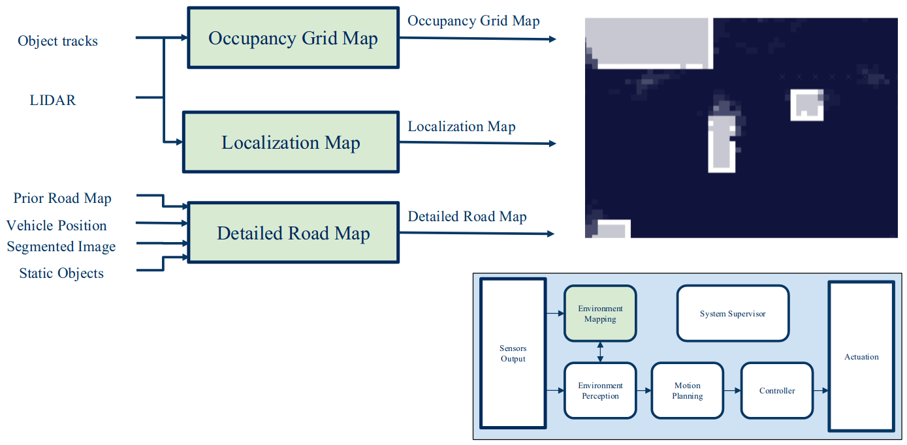

- Localization Map: constructed from LIDAR,or camera data, is used by the localization module in order to imporve ego state estimation
  - Sensor data is compared to this map while driving to determine the motion of the car relative to the localization map
  - This motion is then combined with other proprioceptor sensor information to accurately localize the ego vehicle

- Detailed Road Map: provides a map of road segments which represent the driving environment that autonomous vehicle is currently driving through
  - It captures signs and lane markings in a manner that can be used for motion planning
  - This map is traditionally a combination of prerecorded data as well as incoming information from the current static environment gathered by the perception stack
  - The environment mapping and perception modules interact significantly to improve the performance of both modules
  - For example, the perception module provide the static environment information needed to update the detailed road map, which is then used by prediction module to create more accurate dynamic object predictions

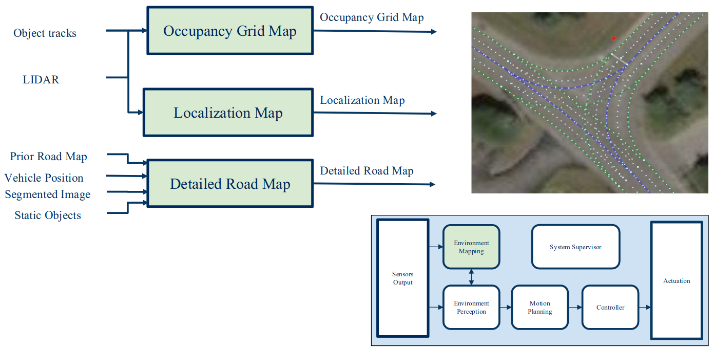

### Motion Planing

The motion planning module makes all the decisions about what actions to take and where to drive based on all of the information provided by the perception and mapping modules.

The module's main output is a safe, efficient and comfortable planned path that moves the vehicle towards its goal.

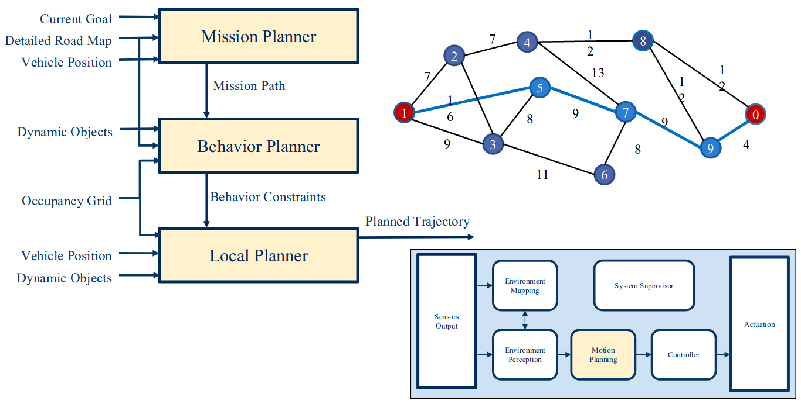

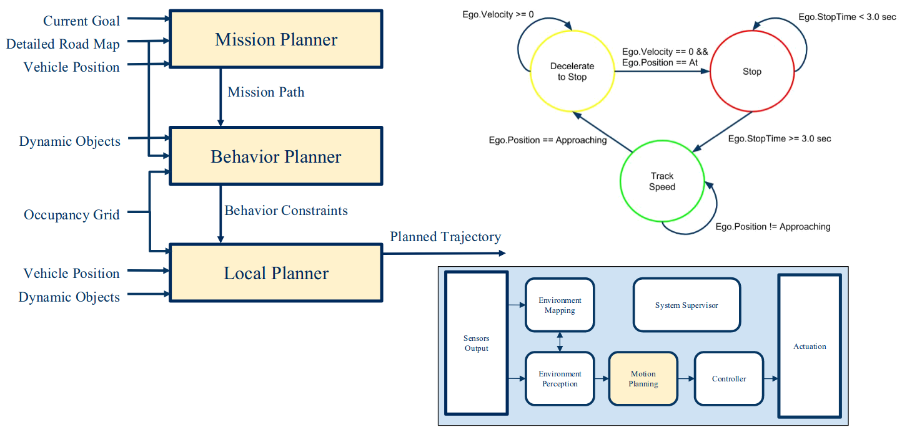

The planned path is then executed by the fourth module, the controller.

### Controller

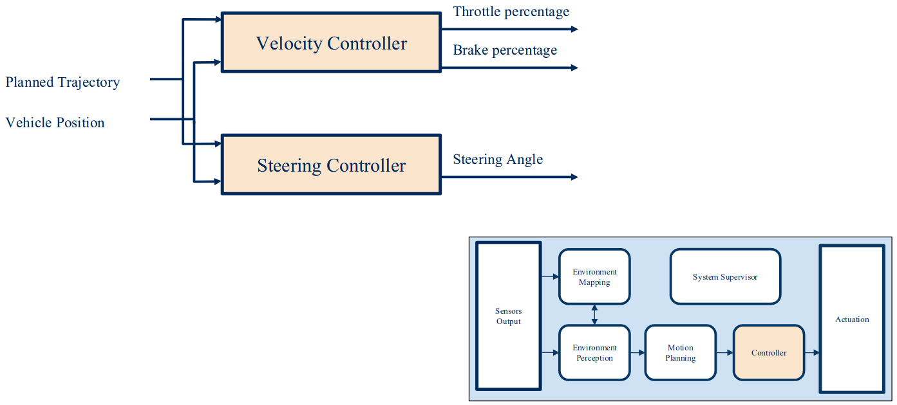

The controller module takes the path and decides on the best steering angle, throttle position, brake pedal position, and gear settings to precisely follow the planned path.

### System Supervisor

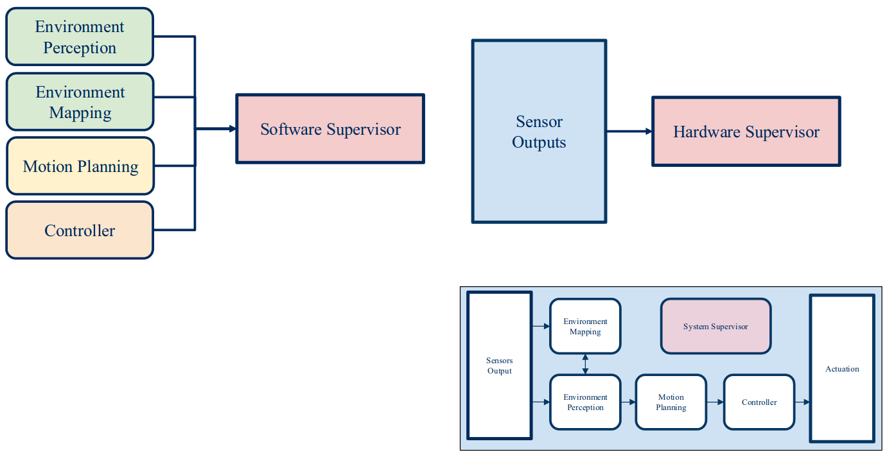

The system supevisor monitors all parts of the software stack, as well as the hardware output, to make sure that all systems are working as intended.

### Supplementary Reading: Software Architecture

Learn more about AV software architecture from the [Team VictorTango - DARPA Urban Challenge Technical Paper](https://pdfs.semanticscholar.org/c10a/cd8c64790f7d040ea6f01d7b26b1d9a442db.pdf).

The system supevisor is also responsible for informing the safety driver of any problems found in the system.

## Lesson 4. Environment Representation

### Point cloud or Feature Map (Localization Map)

- The localization map uses recorded LIDAR points or images, which is combined to make a point cloud representation of the environment
  - As new LIDAR camera data is received, it is compared to the localization map and a measurement of the ego vechicle position is created by aligning the new data with the existing map
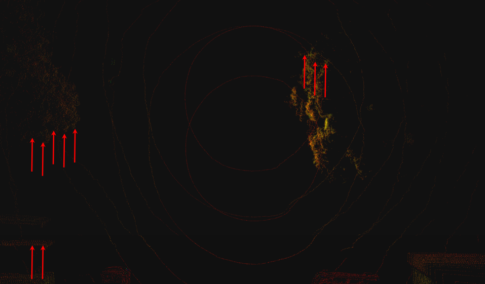
- This measurement is then combined with other sensors to estimate ego motion and ultimately used to control the vehicle

### Occupancy Grid

- Discretized fine grain grid map
  - Can be 2D or 3D
- Occupancy by a static object
  - Trees and buildings
- Curbs and other non drivable surfaces
  - Dynamic objects are removed

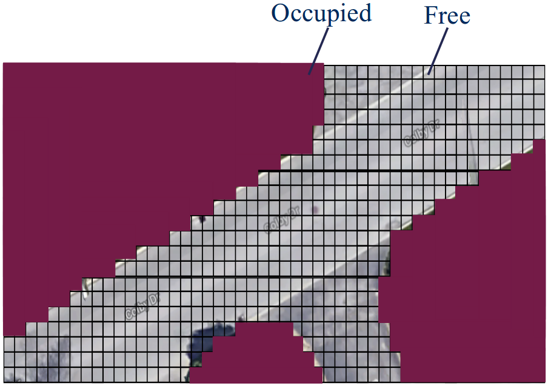

### Detailed Roadmap

3 Methods of creation:

- Fully Online
- Fully Offline
- Created Offline and Updated Online

### Supplementary Reading: Environment Representation

This paper discusses a highly detailed map used for autonomous driving:

- P. Bender, J. Ziegler and C. Stiller, "[Lanelets: Efficient map representation for autonomous driving](https://ieeexplore.ieee.org/abstract/document/6856487)," 2014 IEEE Intelligent Vehicles Symposium Proceedings, Dearborn, MI, 2014, pp. 420-425. doi: 10.1109/IVS.2014.6856487 (Lanelet)
