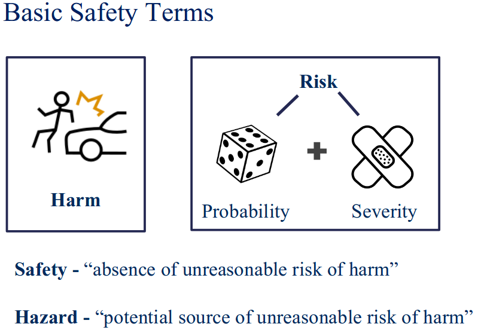
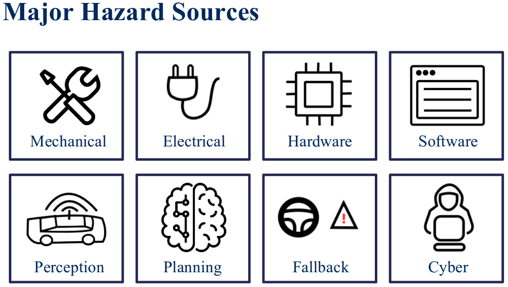

# Week 3. Safety Assurance for Autonomous Vehicles

## Lesson 1. Safety Assurance for Self-Driving Vehicles

**Quiz**: The following statement is an **ACCURATE** and **COMPLETE** definition of safety in terms of self-driving vehicles, TRUE or FALSE?

The term safety is the process of avoiding **ANY RISK** of harm to a living thing.

- True
- False

**Answer**: False

    Safety is the process of avoiding UNREASONABLE RISK of harm to a living thing. For example, driving into an intersection when the traffic signal is red would be unsafe, as it leads to unreasonable risk of harm to the occupants of the vehicle and the other vehicles moving through the intersection.

### Supplementary Reading: Safety Assurance for Self-Driving Vehicles

We have a couple of links in this Supplementary Reading discussing various aspects of safety assurance.

- Here's a link for [NTSB's Report on the 2018 Uber Crash](https://www.ntsb.gov/investigations/AccidentReports/Reports/HWY18MH010-prelim.pdf)

- Check out Dr. Krzysztof Czarnecki'spaper on [WISE Drive: Requirements Analysis Framework for Automated Driving Systems](https://uwaterloo.ca/waterloo-intelligent-systems-engineering-lab/projects/wise-drive-requirements-analysis-framework-automated-driving). You will watch an interview with Dr. Czarnecki's later in this Module
- Learn more about the non-mandatory safety guidelines for autonomous cars in the [NHTSA - Automated Driving Systems: A Vision for Safety 2.0](https://www.nhtsa.gov/sites/nhtsa.dot.gov/files/documents/13069a-ads2.0_090617_v9a_tag.pdf) report

## Lesson 2. Industry Methods for Safety Assurance and Testing

### Waymo: Safety Levels

Waymo covers all 12 of the NHTSA concepts, but organizes them into 5 levels safety approaches.

    

First, Waymo systems are designed to perform safe driving at the behaviral level. This includes decisions that follow the traffic rules, can handle a wide range of scenarios within the ODD, and maintain vehicle safety through it.

Second, Waymo ensures that the systems have backups and redundancies. This is so that even if a fault or failures occurs, the car can switch to a secondary component or a backup process to minimize the severity of failures and return the vehicle to a safe state, continuing the drive if possible. This is refered to as Functional Safety.

Next, Waymo emphasizes crash safety as recommended by the NHTSA. It designs systems that ensure minimun damage to people inside the car in the event of a crash.

Next, it tries to ensure Operational Safety.So, that mean its interfaces are usable and convenient and intuitive. The focus here is on allowing passengers to have some levels of control over the vehicle, but only in ways that maintain system safety.

Finally, Waymo fosters Non-collision safety. This refers to system designs that minimize the danger to people that may interact with the system in some ways, first responders, mechanics, hardware engineers, and so on.

These five pillars form Waymo's safety by design system, and leads to a system of extensive requirement definition, design interation, and testing to ensure the objectives of the system are met by each component.

### Waymo: Safety Process

    

    

    

    

### General Motors Safety Perspective

    

    

